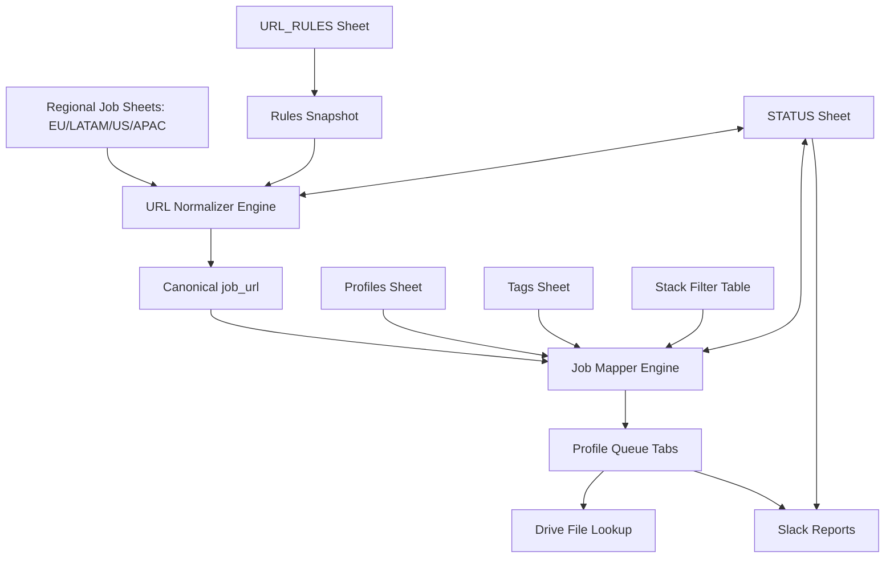
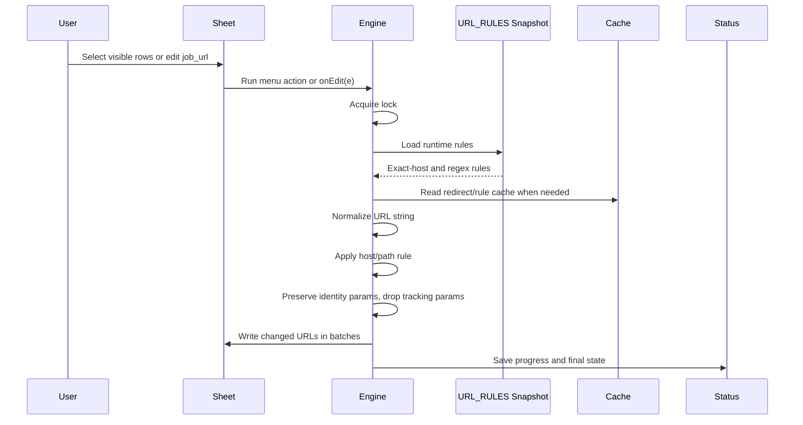
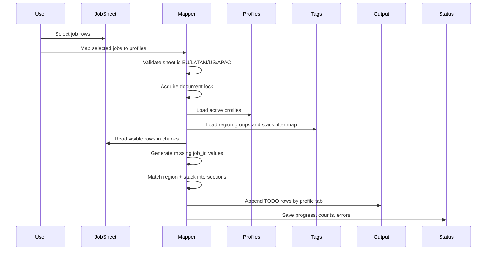
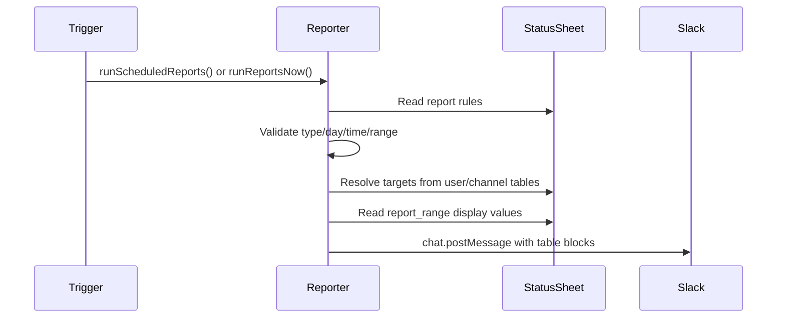
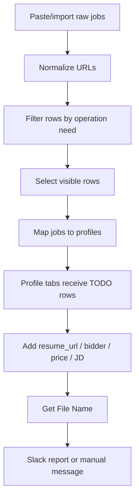

# BOC-E / BidOS V4 

Production-Ready GAS Operations Platform

Enterprise Google Apps Script operating system for job-bid operations, profile routing, job URL canonicalization, resume file lookup, and Slack reporting inside Google Sheets.

The system is designed around one spreadsheet as the operational control plane. Job sources are stored in regional job sheets, profiles define routing rules, URL rules define canonical job links, profile tabs become work queues, and the `STATUS` sheet exposes runtime health for long-running engines.

---

## 1. Product Purpose

BOC-E turns a Google Sheet into a controlled bid-operations platform:

1. Normalize job URLs from multiple ATS/job-board sources.
2. Match visible selected jobs to eligible profiles by region and stack.
3. Create profile-specific application queues without duplicates.
4. Resolve Google Drive resume file names and creation dates.
5. Send operational reports and manual messages to Slack.
6. Track engine progress, errors, and resumable state in a shared status surface.

This project is production-oriented for repeated operational use, not a one-off script. It includes chunked processing, locks, resumable state, rule snapshots, cache warming, Slack validation, and guarded menu-based execution.

---

## 2. Runtime Platform

| Area | Value |
|---|---|
| Platform | Google Apps Script |
| Runtime | V8 |
| Primary UI | Google Sheets custom menu |
| Time zone | `America/Sao_Paulo` |
| Logging | Stackdriver / Apps Script execution logs |
| Deployment | clasp project using `.clasp.json` |
| Main data store | Google Sheets |
| State store | Script Properties + `STATUS` sheet |
| Cache store | Apps Script CacheService |
| External integrations | Google Drive, Slack API, optional URL redirect fetches |

---

## 3. Repository / Script Files

| File | Responsibility |
|---|---|
| `layout_const.js` | Global configuration: sheet names, headers, status keys, menu items, chunk sizes, cache keys, runtime limits. |
| `ui_menu.js` | Creates the `BOC-E` spreadsheet menu on open. |
| `url_normalizer.runtime.js` | Production URL normalization engine, rule publishing, cache warming, on-edit normalization, resumable batch runs. |
| `url_rules.seeder.backup.js` | One-time installer/reset script for the `URL_RULES` sheet. Runtime normalization does not read from this file directly. |
| `profile_job_mapper.js` | Job-to-profile matching engine. Reads selected visible job rows and writes profile queue rows. |
| `getfilename.js` | Google Drive file/folder ID extraction and selected-row resume file metadata lookup. |
| `slack_reporter.js` | Slack scheduled reports, manual messages, target resolution, and report-rule validation. |
| `appsscript.json` | Apps Script manifest. |
| `.clasp.json` | clasp project binding. |
| `.claspignore` | Files excluded from clasp push, including docs and backups. |

---

## 4. Sheet Architecture

### 4.1 Core Sheets

| Sheet | Purpose |
|---|---|
| `EU`, `LATAM`, `US`, `APAC` | Job source sheets. These are the only default sheets accepted by the mapper and auto-normalizer. |
| `Profiles` | Defines active profiles and their routing tags. |
| `Tags` | Defines region/tag groups used to expand matching logic. |
| `URL_RULES` | Business-owned source of truth for ATS/job-board URL canonicalization rules. |
| `STATUS` | Shared operational status sheet for normalize engine, mapping engine, Slack users/channels, and report rules. |
| Profile tabs | Output queues generated from profiles, for example `Joao(EU_SWE)`. |

### 4.2 Required Job Sheet Headers

Job sheets should include:

| Header | Required | Description |
|---|---:|---|
| `job_id` | Recommended | Unique job ID. Auto-generated when blank during mapping. |
| `date` | Optional | Job intake date. |
| `job_url` | Required | Raw or normalized job URL. |
| `region_tags` | Optional | Region tags. Defaults to the sheet name when blank. |
| `stack_tags` | Optional | Stack tags. Defaults to `SWE` when blank. |

### 4.3 Required Profile Sheet Headers

The `Profiles` sheet supports normalized aliases, but production usage should standardize on:

| Header | Description |
|---|---|
| `profile_id` | Stable unique profile identifier. Used in `app_key`. |
| `profile_name` | Human-readable profile name. |
| `region_tag` / `region_tags` | One or more region tags. |
| `stack_tag` / `stack_tags` | One or more stack tags. |
| `status` / `active` | Active marker. Inactive values include `inactive`, `false`, `no`, `0`, `disabled`, `off`, and blank. |
| `sheet_name` | Optional explicit output tab name. If blank, the system creates one from profile name, region, and stack. |

### 4.4 Profile Output Tab Headers

Every profile queue tab is self-healed to include:

```text
app_key, date, job_url, status, bidder, resume_url, file_name, created_at, price, error, JD
```

`app_key` is the idempotency key in the format:

```text
profile_id|job_id
```

---

## 5. High-Level Architecture



### Design Pattern

The product follows a **Sheet as Control Plane + Apps Script as Runtime Engine** model:

- Spreadsheet tabs hold operational data and business rules.
- Apps Script functions execute controlled engines.
- Script Properties store resumable state and published rule snapshots.
- CacheService accelerates repeated URL rule and redirect operations.
- The `STATUS` sheet makes runtime progress visible to operators.

---

## 6. Custom Menu

When the spreadsheet opens, `onOpen()` creates the `BOC-E` menu with these actions:

| Menu Item | Function | Purpose |
|---|---|---|
| Map selected jobs to profiles | `mapSelectedVisibleJobsToProfiles` | Route selected visible jobs into profile queues. |
| Resume job mapping | `RESUME_JOB_MAPPING` | Continue a paused mapping job. |
| Show job mapping status | `SHOW_JOB_MAPPING_STATUS` | Write current mapper state to `STATUS`. |
| Get File Name | `fillFileNamesFromSelection` | Resolve Drive file/folder names and created dates from selected resume URLs. |
| Resume normalize | `RESUME_NORMALIZE` | Continue a paused URL normalization run. |
| Show normalize status | `SHOW_NORMALIZE_STATUS` | Write current normalizer state to `STATUS`. |
| Publish URL Rules | `UPDATE_RULES_SNAPSHOT_FROM_SHEET` | Validate and publish `URL_RULES` to Properties + Cache + Memory. |
| Warm cache | `WARM_URL_NORMALIZER_RUNTIME` | Load published URL rules into runtime memory. |
| Send manual message | `uiSendManualMessage` | Send a manual Slack message to configured users/channels. |
| Run reports now | `runReportsNow` | Send a configured report rule on demand. |

---

## 7. URL Normalizer Engine

The URL normalizer converts raw job-board links into stable canonical URLs. It supports batch processing, on-edit normalization, optional redirect expansion, rule snapshots, and identity-param protection.

### 7.1 Main Runners

| Function | Purpose |
|---|---|
| `RUN_NORMALIZE_NOW()` | Batch-normalize selected visible rows, or visible rows in the active job sheet. No redirect expansion. |
| `RUN_NORMALIZE_WITH_REDIRECTS()` | Same as normal run, but follows redirects before canonicalization. |
| `RESUME_NORMALIZE()` | Continue a previously stopped run. |
| `SHOW_NORMALIZE_STATUS()` | Display/persist current normalize status. |
| `RESET_NORMALIZE_STATUS()` | Reset saved normalizer progress. |
| `UPDATE_RULES_SNAPSHOT_FROM_SHEET()` | Publish `URL_RULES` into script properties/cache/memory. |
| `WARM_URL_NORMALIZER_RUNTIME()` | Preload rules from published snapshot into memory. |
| `CLEAR_URL_NORMALIZER_CACHE()` | Clear in-memory and script cache rule/header caches. |

### 7.2 Normalization Flow



### 7.3 Rule Model

`URL_RULES` has these headers:

| Column | Meaning |
|---|---|
| `enabled` | Boolean flag. Disabled rules are ignored. |
| `host_regex` | Host matching regex. Anchored exact-host regexes are optimized into a hash map. |
| `path_regex` | Optional path matching regex. |
| `path_replacement` | Optional replacement pattern for canonical path. |
| `keep_params` | Comma-separated query params that must be preserved. |
| `drop_params` | Comma-separated query params to remove for this rule. |
| `notes` | Human-readable rule purpose. |

### 7.4 Rule Publishing Lifecycle

```text
URL_RULES sheet
   ↓ UPDATE_RULES_SNAPSHOT_FROM_SHEET()
Validation
   ↓
Script Properties snapshot
   ↓
Script Cache
   ↓
In-memory runtime cache
   ↓
URL normalization execution
```

Operators should edit `URL_RULES`, then run **Publish URL Rules**. Editing the sheet alone does not apply changes immediately.

### 7.5 URL Normalization Rules

The engine applies these production rules:

1. Clean input strings: trim whitespace, remove zero-width characters, remove surrounding quotes/brackets.
2. Add `https://` for host-like values without protocol.
3. Canonicalize host names to lowercase and remove `www.`.
4. Normalize path formatting.
5. Apply exact-host rules first for performance.
6. Apply regex/wildcard rules second.
7. Preserve job identity query parameters when required.
8. Remove global tracking parameters such as `utm_*`, `fbclid`, `gclid`, `msclkid`, `source`, `ref`, `tracking`, and similar values.
9. Preserve explicit `keep_params` even when their names resemble tracking parameters.
10. Respect explicit rule-level `drop_params`.
11. Optionally follow redirects, with cache and per-run limits.

### 7.6 Identity Parameter Protection

Some job boards encode the true job identity in query parameters instead of the path. The engine has hardcoded guardrails for known cases, including:

| Host | Path | Protected Params |
|---|---|---|
| `linkedin.com` | `/jobs/search` | `currentJobId` |
| `jobs.paymentology.com` | `/detail` | `uid`, `coref` |
| `ashbyhq.com` | `/careers` | `ashby_jid` |
| `kuali.co` | `/positions` | `gnk`, `gni` |
| `job-boards.greenhouse.io` | `/embed/job_app` | `token` |

This prevents global tracking cleanup from deleting values that identify the actual job.

### 7.7 Runtime Safety

| Mechanism | Purpose |
|---|---|
| `LockService` | Prevents concurrent normalizer runs. |
| Chunked reads/writes | Avoids Apps Script timeout and excessive API calls. |
| Safe runtime deadline | Stops before hard Apps Script timeout. |
| Saved state | Enables resume after timeout or interruption. |
| Status writes | Makes progress visible in `STATUS`. |
| CacheService | Reduces repeated rule parsing and redirect calls. |
| Redirect cap | Prevents URL expansion from consuming the entire run. |

---

## 8. Job-to-Profile Mapper Engine

The mapper takes selected visible job rows from a regional job sheet and appends matching jobs to each profile’s queue tab.

### 8.1 Main Runners

| Function | Purpose |
|---|---|
| `mapSelectedVisibleJobsToProfiles()` | Start mapping selected visible rows. |
| `RESUME_JOB_MAPPING()` | Resume a saved mapping run. |
| `SHOW_JOB_MAPPING_STATUS()` | Write current mapping status to `STATUS`. |
| `RESET_JOB_MAPPING_STATUS()` | Clear saved mapping state. |

### 8.2 Mapper Workflow



### 8.3 Matching Logic

A job matches a profile when both conditions are true:

1. **Region match:** expanded profile regions and expanded job regions intersect.
2. **Stack match:** expanded profile stack set and expanded job stack set intersect, unless either side is empty.

Tags are normalized by trimming, uppercasing, and replacing whitespace with underscores.

### 8.4 Region Expansion

The `Tags` sheet maps group tags to child tags. Example:

| group | tag |
|---|---|
| EU | GERMANY |
| EU | FRANCE |
| LATAM | BRAZIL |

If a profile has `EU`, it can match jobs tagged `GERMANY` or `FRANCE` after expansion.

### 8.5 Stack Expansion

The stack filter table range is configured as:

```text
F1:L16
```

The table is loaded into a stack map and used to expand profile/job stack tags. Canonical stack tags include:

```text
SWE, AI, QA
```

### 8.6 Output and Idempotency

For each matching profile/job pair, the mapper creates:

```text
app_key = profile_id|job_id
status = TODO
```

Before writing, it loads existing `app_key` values from the target profile tab. Duplicate keys are skipped and counted as duplicates.

### 8.7 Runtime Safety

| Mechanism | Purpose |
|---|---|
| Document lock | Prevents overlapping mapping runs. |
| Lease state | Detects fresh running jobs. |
| Chunk size `50` | Controls write and execution load. |
| Max runtime `4 minutes` | Stops before Apps Script timeout. |
| Time trigger resume | Schedules continuation when paused. |
| Existing app key cache | Prevents duplicate queue entries. |
| Header self-healing | Adds missing profile-tab headers. |

---

## 9. Resume File Metadata Lookup

The file lookup feature fills `file_name` and `created_at` based on a Drive URL in `resume_url`.

### Supported URL Patterns

The extractor supports common Drive and Docs formats:

```text
https://drive.google.com/file/d/FILE_ID/view
https://drive.google.com/document/d/FILE_ID/edit
https://docs.google.com/spreadsheets/d/FILE_ID/edit
https://docs.google.com/presentation/d/FILE_ID/edit
https://docs.google.com/forms/d/FILE_ID/edit
https://drive.google.com/open?id=FILE_ID
https://drive.google.com/uc?id=FILE_ID
https://drive.google.com/thumbnail?id=FILE_ID
https://drive.google.com/export?id=FILE_ID
https://drive.google.com/drive/folders/FOLDER_ID
```

### Behavior

1. User selects rows in a profile tab.
2. `fillFileNamesFromSelection()` reads only selected `resume_url` cells.
3. It extracts the Drive file/folder ID.
4. It tries `DriveApp.getFileById(id)` first.
5. If file lookup fails, it tries `DriveApp.getFolderById(id)`.
6. It writes file/folder name to `file_name`.
7. It writes created date to `created_at` using `MM/dd`.
8. Filter-hidden rows are skipped.

### Output Values

| Value | Meaning |
|---|---|
| `Invalid URL` | No Drive ID could be extracted. |
| `No access` | The script account cannot access the file/folder. |
| `MM/dd` date | Drive item creation date. |

---

## 10. Slack Reporting Engine

Slack integration sends scheduled or manual messages using Slack `chat.postMessage`.

### 10.1 Required Script Property

Set this in Apps Script project properties:

```text
slack_bot_token = xoxb-...
```

Do not store Slack tokens in sheet cells or code.

### 10.2 STATUS Sheet Slack Configuration

| Range | Purpose |
|---|---|
| `G2:I8` | User table: `User | Mail | SlackID` |
| `K2:L9` | Channel table: `channel_name | channel_id` |
| `G12:M17` | Report rules: `report_title | type | target_names | report_range | day/date | time | enabled` |

### 10.3 Report Rule Types

| Type | Required day/date | Example |
|---|---|---|
| `daily` | `each` | Every day at `09:30` |
| `weekly` | Weekday list | `Mon` or `Mon,Thu` |
| `once` | `MM/dd` | `12/31` |

### 10.4 Slack Report Flow



### 10.5 Slack Guardrails

- Invalid report ranges are rejected before sending.
- Invalid time must be `HH:mm`.
- Weekly days must be valid weekday abbreviations.
- Once rules require valid `MM/dd`.
- Unknown Slack targets are skipped and logged.
- Slack API errors raise exceptions with the returned error code.

---

## 11. End-to-End Production Workflow

### 11.1 Initial Setup

1. Open the target Google Sheet.
2. Ensure required sheets exist: `EU`, `LATAM`, `US`, `APAC`, `Profiles`, `Tags`, `STATUS`, `URL_RULES`.
3. Add required headers to job sheets and profile sheets.
4. Run `SETUP_URL_RULES_BASE()` only if `URL_RULES` needs to be installed or reset.
5. Review and customize `URL_RULES`.
6. Run **Publish URL Rules**.
7. Run **Warm cache**.
8. Add Slack target tables and report rules in `STATUS` if Slack reporting is used.
9. Set `slack_bot_token` in Script Properties.

### 11.2 Daily Operator Flow



### 11.3 Normalizing Jobs

1. Paste or edit job URLs in a regional job sheet.
2. For small edits, `onEdit(e)` normalizes changed `job_url` cells automatically.
3. For batch runs, filter and select rows, then run a normalizer action from the menu/editor.
4. Check `STATUS` for progress.
5. If stopped before timeout, run **Resume normalize**.

### 11.4 Mapping Jobs

1. Open one of `EU`, `LATAM`, `US`, `APAC`.
2. Apply any filters needed.
3. Select the visible rows to map.
4. Click **Map selected jobs to profiles**.
5. Monitor `STATUS`.
6. If paused, click **Resume job mapping**.
7. Review generated profile tabs and `TODO` rows.

### 11.5 Completing Resume Metadata

1. In a profile tab, add `resume_url` values.
2. Select the rows.
3. Click **Get File Name**.
4. Review `file_name` and `created_at`.

### 11.6 Reporting to Slack

1. Configure Slack users/channels and rules in `STATUS`.
2. Run **Run reports now** for a manual report rule.
3. Use **Send manual message** for ad hoc Slack messages.
4. Use `runScheduledReports()` with an Apps Script time trigger for scheduled reporting.

---

## 12. Production Rules and Operating Standards

### 12.1 Data Ownership Rules

- `URL_RULES` is the business-owned source of truth for URL canonicalization.
- `Profiles` is the business-owned source of truth for profile eligibility.
- `Tags` is the business-owned source of truth for regional grouping.
- Profile tabs are operational queues, not source configuration.
- `STATUS` is for runtime visibility and Slack/report settings.

### 12.2 URL Rule Change Rules

1. Never edit hardcoded normalizer internals for a normal ATS rule if the rule can be represented in `URL_RULES`.
2. Add or modify rows in `URL_RULES`.
3. Run **Publish URL Rules**.
4. Run **Warm cache** for immediate runtime availability.
5. Test with representative URLs before large batch runs.
6. Use hardcoded identity protection only for cases where job identity would otherwise be destroyed by generic cleanup.

### 12.3 Job Mapping Rules

1. Only map from approved job sheets: `EU`, `LATAM`, `US`, `APAC`.
2. Always select the target rows before mapping.
3. Use filters to control the visible operational batch.
4. Keep `profile_id` stable. Changing it changes idempotency behavior.
5. Keep `job_id` stable. Blank IDs are auto-generated from sheet tag + row number.
6. Do not manually duplicate `app_key` rows unless intentionally overriding the queue state.

### 12.4 Slack Rules

1. Store Slack token only in Script Properties.
2. Use Slack IDs, not display names, in the target table ID columns.
3. Keep report ranges small enough to fit readable Slack table blocks.
4. Validate scheduled rules before enabling.
5. Prefer channel reporting for operations; use direct users for exception workflows.

---

## 13. State, Locks, and Recovery

### 13.1 State Keys

| Key | Purpose |
|---|---|
| `JOB_MAP_STATE_JSON` | Saved job mapper state. |
| `url_normalizer_status_v3` | Saved normalizer state. |
| `url_rules_snapshot_v1` | Published URL rules snapshot base key. |
| `url_rules_snapshot_meta` | Metadata about published URL rules. |

### 13.2 Runtime States

```text
READY
RUNNING
DONE
ERROR
STOPPED_BEFORE_TIMEOUT
```

### 13.3 Recovery Actions

| Problem | Recovery |
|---|---|
| Normalizer stopped before timeout | Run `RESUME_NORMALIZE()`. |
| Mapper paused before timeout | Run `RESUME_JOB_MAPPING()`. |
| Mapper appears stuck | Check `STATUS`; if lease is stale, reset mapping state. |
| Rules not applied | Run `UPDATE_RULES_SNAPSHOT_FROM_SHEET()` then `WARM_URL_NORMALIZER_RUNTIME()`. |
| Wrong URL output | Inspect matching `URL_RULES` row, publish again, clear cache if needed. |
| Slack target not found | Check `STATUS` target tables and spelling. |
| Drive file shows `No access` | Grant access to the script-running account. |

---

## 14. Security and Compliance Notes

- Do not commit secrets, Slack tokens, `.env` files, or private data.
- `.claspignore` excludes `.env`, markdown docs, backups, tests, Git metadata, and `node_modules`.
- Drive lookup requires Drive authorization and only accesses files/folders linked in selected rows.
- Slack token should be stored in Script Properties, not source code.
- URL redirect expansion calls external URLs via `UrlFetchApp`; use the non-redirect runner when external fetch behavior is not desired.
- The project uses spreadsheet-visible operational state, so avoid storing sensitive credentials or private applicant data in `STATUS`.

---

## 15. Deployment with clasp

### 15.1 Prerequisites

```bash
npm install -g @google/clasp
clasp login
```

### 15.2 Push Code

The project is bound by `.clasp.json` to the Apps Script project ID.

```bash
clasp push
```

Because `.claspignore` excludes `README.md`, backup files, tests, and environment files, documentation and local-only artifacts will not be pushed.

### 15.3 Recommended Production Deployment Practice

1. Push code to a staging Apps Script project first.
2. Run syntax and manual smoke tests.
3. Validate `URL_RULES` publishing.
4. Test normalizer on a small filtered range.
5. Test mapper on 2–5 selected visible rows.
6. Confirm Slack reporting with a test channel.
7. Push/promote to production.

---

## 16. Testing Checklist

### URL Normalizer

- [ ] Greenhouse classic URL canonicalizes correctly.
- [ ] Greenhouse embed preserves `token`.
- [ ] LinkedIn search preserves `currentJobId`.
- [ ] Ashby careers preserves `ashby_jid`.
- [ ] Tracking parameters are removed.
- [ ] `utm_*`, `fbclid`, `gclid`, and `source` are removed unless explicitly preserved.
- [ ] Batch run resumes after timeout.
- [ ] `STATUS` updates progress and final state.

### Mapper

- [ ] Mapping rejects unsupported active sheets.
- [ ] Blank `job_id` values are generated.
- [ ] Filter-hidden and user-hidden rows are skipped.
- [ ] Region group expansion works.
- [ ] Stack expansion works.
- [ ] Duplicate `app_key` rows are skipped.
- [ ] Missing profile-tab headers are self-healed.
- [ ] Resume works after pause.

### Drive Lookup

- [ ] File URL resolves name and created date.
- [ ] Folder URL resolves name and created date.
- [ ] Invalid URLs write `Invalid URL`.
- [ ] Inaccessible files write `No access`.
- [ ] Filter-hidden rows remain unchanged.

### Slack

- [ ] Missing token throws a clear error.
- [ ] Invalid report range is rejected.
- [ ] Daily, weekly, and once rules validate correctly.
- [ ] Unknown targets are logged and skipped.
- [ ] Slack API errors are surfaced.

---

## 17. Enterprise Maintenance Guidelines

### Add a New Region Sheet

1. Add the new sheet name to `CFG.SHEETS.JOB_FALLBACK`.
2. Confirm headers match the job sheet contract.
3. Add matching region tags in `Tags`.
4. Add profile coverage in `Profiles`.
5. Test normalizer and mapper on a small sample.

### Add a New Stack Category

1. Add the canonical stack in `CFG.STACK_TAGS`.
2. Update `CFG.CANONICAL_STACK_TAG_SET` behavior if needed.
3. Update the stack filter table range/data.
4. Add profile/job tags using the canonical tag.
5. Test stack expansion and matching.

### Add a New ATS URL Rule

1. Add a new row to `URL_RULES`.
2. Prefer exact anchored host regex when possible, for example `^jobs.example.com$`.
3. Use path regex and replacement to preserve only the stable job identity path.
4. Use `keep_params` only when query parameters identify the job.
5. Use `drop_params` for source/tracking params specific to the ATS.
6. Publish rules and warm cache.
7. Test before running large batches.

---

## 18. Known Constraints

- Google Apps Script has runtime limits; long runs are intentionally chunked and resumable.
- Slack table blocks may have practical readability and platform limits; keep report ranges concise.
- URL redirect expansion depends on external site behavior and may fail or be blocked.
- Drive metadata lookup depends on permissions of the executing account.
- Apps Script simple triggers have authorization limits; production runners should be menu/editor/button driven.

---

## 19. Operational Glossary

| Term | Meaning |
|---|---|
| Job sheet | Regional sheet containing source job rows. |
| Profile | A candidate/account/persona eligible for certain region and stack tags. |
| Profile tab | Work queue for a profile. |
| App key | Unique pair of profile and job: `profile_id|job_id`. |
| URL rule | Host/path/query canonicalization rule in `URL_RULES`. |
| Rule snapshot | Published serialized rules stored in Script Properties/Cache. |
| Identity param | Query parameter required to identify the true job posting. |
| Tracking param | Query parameter used for attribution/referral and removed from canonical URLs. |
| Lease | Mapper freshness marker used to prevent accidental overlapping runs. |

---

## 20. Minimal Production Runbook

```text
1. Import or paste jobs into EU/LATAM/US/APAC.
2. Normalize URLs.
3. Filter and select rows to process.
4. Map selected visible jobs to profiles.
5. Review generated profile tabs.
6. Add resume links and operational fields.
7. Run file-name lookup.
8. Send Slack report or scheduled notification.
9. Check STATUS after every major batch.
```

---

## 21. Ownership Model

| Owner | Responsibilities |
|---|---|
| Operations user | Import jobs, select batches, review profile queues, send reports. |
| Rules maintainer | Maintain `URL_RULES`, publish snapshots, validate ATS behavior. |
| Profile maintainer | Maintain `Profiles`, tags, stack coverage, active/inactive status. |
| System maintainer | Manage Apps Script code, clasp deployment, Slack token, triggers, logs. |

---

## 22. Production Summary

BOC-E / BidOS V4 is an enterprise bid-operations system built on Google Sheets and Apps Script. Its strongest production qualities are centralized configuration, deterministic profile routing, stable URL canonicalization, batch-safe execution, resumable long-running jobs, and Slack-based reporting. The spreadsheet remains the business control plane, while Apps Script provides controlled engines for normalization, mapping, metadata enrichment, and reporting.
