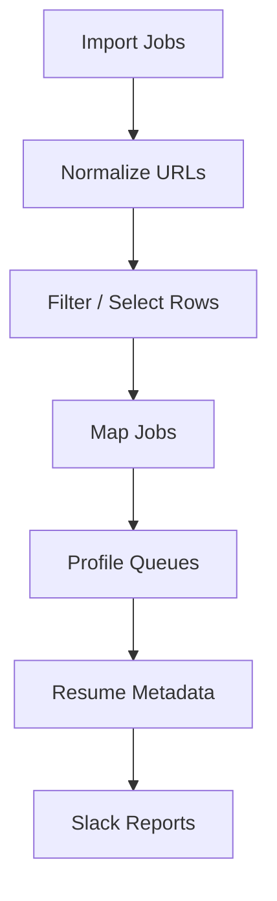

# BidOS Usage Guide

Simple operator guide for running BidOS inside Google Sheets.

---

## What is BidOS?

BidOS is a Google Apps Script operational platform that:

✓ Normalizes job URLs  
✓ Maps jobs into profile queues  
✓ Prevents duplicates  
✓ Resolves resume metadata  
✓ Sends Slack reports  
✓ Supports resumable long-running operations  

---

## Required Sheets

| Sheet | Purpose |
|---|---|
| EU / LATAM / US / APAC | Job source sheets |
| Profiles | Profile routing rules |
| Tags | Region groups |
| URL_RULES | URL normalization rules |
| STATUS | Runtime status + Slack settings |
| Profile Tabs | Generated work queues |

---

## Quick Start

#### Step 1 — Import Jobs

Paste jobs into:

```text
EU
LATAM
US
APAC
```

Required columns:

| Header | Required |
|---|---:|
| job_url | ✓ |
| job_id | Recommended |
| region_tags | Optional |
| stack_tags | Optional |

---

#### Step 2 — Normalize URLs

Use menu:

```text
BOC-E
   ↓
Resume Normalize
```

or

```text
RUN_NORMALIZE_NOW()
```

Purpose:

```text
raw job URL
      ↓
canonical URL
      ↓
stable matching
```

---

#### Step 3 — Select Jobs

Apply filters if needed.

Select visible rows only.

BidOS processes:

```text
Selected + Visible Rows
```

Hidden rows are skipped.

---

#### Step 4 — Map Jobs

Menu:

```text
BOC-E
   ↓
Map selected jobs to profiles
```

This creates:

```text
Profile Queue Tabs
```

Example:

```text
John(EU_SWE)
Anna(AI_US)
```

---

#### Step 5 — Review Queue Tabs

Generated rows contain:

| Column | Purpose |
|---|---|
| app_key | unique ID |
| status | TODO / ERROR |
| job_url | normalized URL |
| resume_url | resume link |
| file_name | Drive filename |
| bidder | owner |
| price | optional |

---

#### Step 6 — Add Resume Links

Paste:

```text
resume_url
```

Supported:

```text
Google Docs

Google Drive files

Google Sheets

Folders
```

Then run:

```text
BOC-E
   ↓
Get File Name
```

Outputs:

```text
file_name

created_at
```

---

## Daily Workflow



---

## Menu Reference

| Menu Item | Purpose |
|---|---|
| Map selected jobs to profiles | Route jobs |
| Resume job mapping | Continue paused mapper |
| Show job mapping status | View mapper progress |
| Get File Name | Resolve Drive metadata |
| Resume normalize | Continue normalizer |
| Show normalize status | View progress |
| Publish URL Rules | Apply rule changes |
| Warm cache | Load rules into memory |
| Send manual message | Send Slack message |
| Run reports now | Send report |

---

## Profile Matching Logic

Job matches profile when:

```text
Region Match
      AND
Stack Match
```

Example:

```text
Job:

EU + SWE

Profile:

EU + SWE

↓

MATCH
```

---

## URL Rules

Rules live inside:

```text
URL_RULES
```

After changing rules:

```text
Edit Rules
     ↓
Publish URL Rules
     ↓
Warm Cache
```

Do NOT forget this step.

---

## Status Monitoring

Open:

```text
STATUS
```

Runtime states:

| State | Meaning |
|---|---|
| READY | waiting |
| RUNNING | active |
| DONE | finished |
| ERROR | failed |
| STOPPED_BEFORE_TIMEOUT | resume required |

---

## Resume After Timeout

Normalizer:

```text
BOC-E

↓

Resume normalize
```

Mapper:

```text
BOC-E

↓

Resume job mapping
```

---

## Slack Reporting

Required:

```text
slack_bot_token
```

Stored inside:

```text
Apps Script Properties
```

Never store tokens inside sheets.

Run manually:

```text
BOC-E

↓

Run reports now
```

---

## Common Problems

| Problem | Fix |
|---|---|
| Nothing mapped | Check selected rows |
| Rules changed but output same | Publish rules + warm cache |
| Resume lookup fails | Check Drive permissions |
| Stopped before timeout | Resume operation |
| Duplicate queue rows | Check app_key |
| No Slack message | Check token |

---

## Rules

✓ Use visible rows only  

✓ Normalize before mapping  

✓ Keep profile_id stable  

✓ Keep URL_RULES updated  

✓ Check STATUS after large runs  

✗ Do not manually edit app_key  

✗ Do not store secrets in sheets  

✗ Do not run large batches without monitoring  

---

## Minimal Operator Runbook

```text
1 Import Jobs

2 Normalize URLs

3 Select Rows

4 Map Jobs

5 Review Profile Tabs

6 Add Resume URLs

7 Get File Name

8 Send Reports

9 Check STATUS
```

---

## BidOS Philosophy

```text
Google Sheets
        ↓

Control Plane

        ↓

Apps Script Engines

        ↓

Operational Workflow
```

BidOS is designed for:

```text
Fast Operations

Repeatable Workflows

Resumable Processing

Low Operational Cost
```
